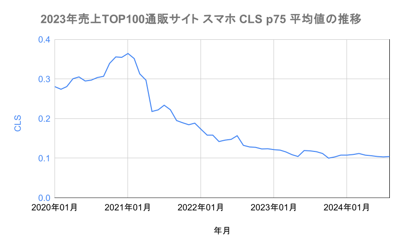
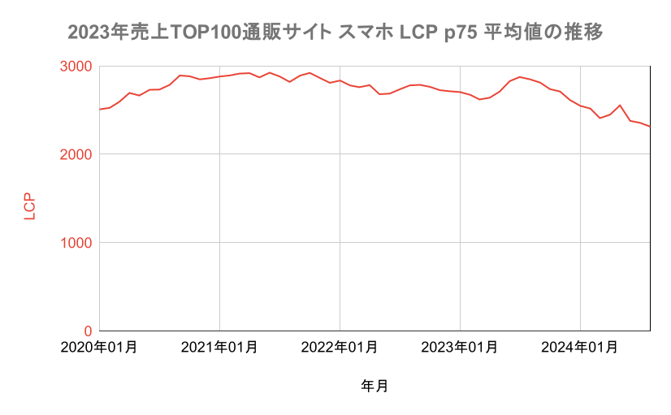
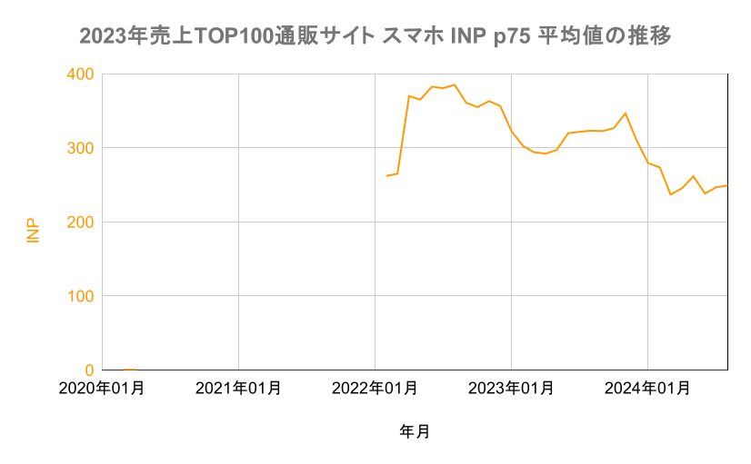

Core Web Vitalsが検索順位に影響すると言われて数年が経った。SEOに関わらず、サイトスピードに関心のあるサイトは少なくないだろう。

そこで日本の主要なECサイト100サイトについて、Core Web Vitalsが改善の方向に向かっているのか調査してみた。

やはり感覚のとおり、CLSは多くのサイトで改善済みだがLCPはほとんど改善が進んでいない実態が見えた。

[[toc]]

---

## CLSは順調に改善

まずは[CLS (Cumulative Layout Shift・レイアウト変化の累積)](https://web.dev/articles/cls?hl=ja)の平均値の推移を見てみよう。以下は主要通販サイト100サイトのスマホ端末におけるCLS(75パーセンタイル)の月次推移だ。

SEOの文脈でCore Web Vitalsが注目を集めた2021年〜2022年にかけて大きく改善が進んだことがわかる。

サイト個別にCLSの推移を眺めていても、やはり同時期に値がほぼ0に近くまで改善できたケースが多い。

したがってCLSの値をほぼ0に完全化できたサイトと、改善が進んでいないサイトに二極化が進み、その結果として平均値が下落していると予想される。

### CLSを改善するには

以下の記事に詳しく述べたので参考いただきたい。

- [Core Web Vitalsの実践的な改善術 - CLS編 | ideaman's Notes](https://notes.ideamans.com/posts/2024/core-web-vitals-in-action-cls.html)

## LCPはほぼ横ばい

次にスマホ端末における[LCP (Largest Contentful Paint・最大要素の表示時間)](https://web.dev/articles/lcp?hl=ja)の75パーセンタイル平均値の推移だが、CLSと比べるとほぼ横ばいである。

当然、SEOのためにLCPも多くのサイトで改善が試みられたであろう。しかしほとんど上手くいっていなかったことがわかる。

この1年くらいはやや下落傾向にあるだろうか。今後の

### LCPを改善するには

丁寧にコーディングすることで改善できるCLSに比べ、LCPの改善は確かに難しい。

加えて、画像軽量化がLCPの改善に効くといった誤解も蔓延している。

そのあたりを含め、以下の記事にLCPの改善のコツをまとめた。

- [Core Web Vitalsの実践的な改善術 - LCP編 | ideaman's Notes](https://notes.ideamans.com/posts/2024/core-web-vitals-in-action-lcp.html)

## INPはやや改善傾向

最後に新しい指標、[INP (Interactive to Next Paint・操作から応答の描画まで)](https://web.dev/articles/inp?hl=ja)のスマホ端末における75パーセンタイル平均値の推移だ。

グラフの中央あたりの開始点に著しい変化があるが、これはデータの収集が始まって間もない時期なのでノイズとして無視してよいだろう。

それ以後はなんとなくだが、改善傾向にあるように見える。

ただ、多くのサイトでINPの改善アクションが効果的に進められている気配は感じない。

そのため改善傾向しているような傾向は見られるが、もしかしたらサイトの改善ではなく、端末やソフトウェアの進歩によるところが大きいのかもしれない。

INPの推移は今後も注視したい。

### INPを改善するには

CLSやLCPはページの読み込みプロセスで評価される値だが、INPはユーザーの実際の操作に基づく指標だ。

そのためPageSpeed Insightsなどのツールでシミュレーションができず、また悪化の本当の原因も掴みにくい。

そこで弊社ではINP悪化の詳細ログをトラッキングするサービスを始めた。

- [INPの収集および改善提案サービスを開始 | ideaman's Notes](https://notes.ideamans.com/posts/2024/speedismoney-fieldwork.html)

また、関係性があると言われるTBT(Total Blocking Time)も含めたINPの改善術について以下の記事にまとめてある。

- [Core Web Vitalsの実践的な改善術 - INP編 | ideaman's Notes](https://notes.ideamans.com/posts/2024/core-web-vitals-in-actino-inp.html)

## 各サイトの詳細

以下のレポートで今回の集計に用いたスピード関連指標の詳細を確認できる。

- [国内通販 売上TOP100 (2023年夏) サイトスピードランキング | 無料 | サイトスピード簡単比較](https://sitespeed-hikaku.com/reports/YYrRMKgS6Lq92ueU2W0g)

## データについて

GoogleはChromeユーザーから実際のサイト閲覧時の各種スピード関連指標を収集し、集計結果をCrUXとして公開している。

- [CrUX の概要  |  Chrome UX Report  |  Chrome for Developers](https://developer.chrome.com/docs/crux?hl=ja)

CrUXはBigQueryを用いて参照し、スマホについてのデータに絞り込んである。

- [BigQuery での CrUX  |  Chrome UX Report  |  Chrome for Developers](https://developer.chrome.com/docs/crux/bigquery?hl=ja)

主要ECサイトは、以下のデータを元に上位100サイトを対象とした。

- [【2023年夏版】通販売上高ランキングTOP523](https://www.netkeizailab.com/?pid=176805140)
