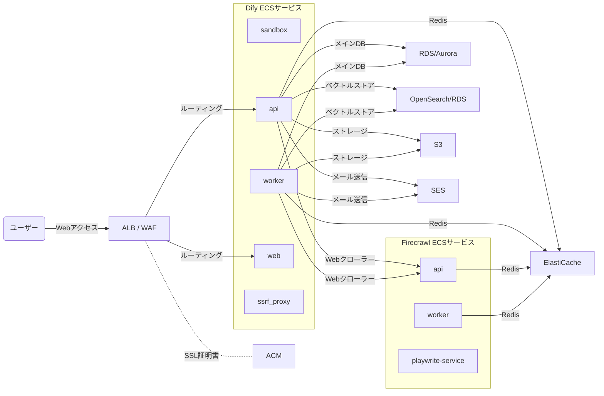

DifyのソースコードにはDocker Composeプロジェクトが同梱されている。

それを利用すると[自分専用のDify環境をサクッとセルフホストできる](./my-own-dify.md)のだが、それを本番運用に利用するのは心許ない。

ではAWS上で、ガチ目のDifyスタックを展開するとしたらどうするか考えてみた。

---

## 全体像

Difyのソースコードは本当にセルフホストに親切で、[Docker Composeプロジェクトのコンポーネント図](https://github.com/langgenius/dify/blob/main/docker/docker-compose.png)もある。

これに加えてストレージも抽象化されており、S3などを選択できる。

### AWS上では

だいぶ複雑だが、ざっくりこんな感じにマッピングできるだろう。

## データベース・ストレージ

### DB - RDS or Aurora

まずはデータベースだが、PostgreSQLを利用している。

したがってRDSやAuroraを利用する。環境変数`DB_*`が設定項目になっている。

### Redis - ElastiCache

Redisも中核的な役割を担っている。特に[Celery](https://docs.celeryq.dev/en/stable/)と組み合わせた非同期タスクの管理と思われる。

最近はServerless版のRedisもあるというElastiCacheに置き換える。

環境変数`REDIS_*`が設定項目になっている。

### ベクトルデータベース - OpenSearch or RDS

[Difyが対応するベクトルデータベース](./dify-vector-stores.md)にまとめたが、多数のベクトルデータベースに対応している。

AWSにはいくつかベクトルデータベースがあるが、現時点で相性が良さそうなのはOpenSearchかpgvectorだろう。

RDSのPostgreSQLがpgvectorもサポートしているので、メインデータベースに同居する方向もありだろう。

環境変数`VECTOR_STORE`と、`OPENSEARCH_*`または`PGVECTOR_*`で設定する。

### ストレージ - S3

デフォルトではローカルストレージを利用するが、各種クラウドのオブジェクトストレージにも対応している。

環境変数`STORAGE_*`と`S3_*`で設定する。

AWSであればS3一択となる。

## Web・メール

### Webゲートウェイ - ALB + ACM

nginxが次の役割を担っている。

- **リバースプロキシ** 後述するコンテナ`api`と`web`へのリクエスト分配
- **セキュアゲートウェイ** コンテナ`certbot`と連携したSSLへの対応

ここはALB + ACMに代替可能だろう。

WAFやCloudFrontも組み合わせるとさらによいかもしれない。

### メール送信 - SES

ぱっと見、パスワードリマインダーなどでしか利用が見られないが、メールの設定も必要となる。

デフォルトでは[Resend](https://resend.com/)が選択されているが、AWSであればSESがよいだろう。

環境変数`MAIL_*`と`SMTP_*`で設定する。

## コンピューティング

### アプリケーション - ECS

Docker Composeのプロジェクトには主要なコンテナが3つと、補助的なコンテナが2つある。

- 主要なコンテナ
  - `api` APIアクセスをホスト
  - `worker` 非同期タスクを処理と思われる
  - `web` Webインターフェースを提供
- 補助的なコンテナ
  - `sandbox` ユーザー定義のコード実行と思われる
  - `ssrf_proxy` SSRF防止プロキシ

これらはECS(Fargate)に展開し、柔軟なスケーリングを可能にしたい。

`api`と`web`についてはALBに接続し、インターネットからの接続を確保する必要がある。

`sandbox`はおそらくだが、ワークフロー上でユーザーが定義した任意のコードブロックを実行する環境だ。

`ssrf_proxy`は名前のとおり、SSRF(Server Side Request Forgery)による攻撃を防止するためのHTTPプロキシと思われる。

実装までは詳しく見られていないが、コンテナやミドルウェアが相互作用するマイクロサービス的な構成であり、LLMモデルへのAPIアクセスもある。そのためHTTPプロキシを設け、安全な相互アクセスを担保しているのだろう。

その意味で、`ssrf_proxy`はサイドカー的に各サービスに1つずつ設けるのが良さそうだ。

### どのようにECSを設計するか

実はDify本体はそこまで高負荷ではないように思う。負荷が高いのはLLMでありベクトルデータベースであり、Difyの役割はあくまでオーケストレーションだからだ。

したがって状況を見ながら以下のステップで、柔軟性と設計の複雑さのトレードオフを図りながら展開するのはどうだろうか。

1. **1サービス** 各コンテナをひとつのサービスに収め、その単位で冗長化・スケーリングする
2. **apiコンテナの分離** `api`はユーザー数に弾力性があるので別サービス化する
3. **1コンテナ1サービス** 順当にコンテナごとにサービスを用意し、柔軟にスケーリングする

## クローラー - Firecrawl

せっかくなのでDifyのお供にFirecrawlも用意したい。

- [FirecrawlのDocker Composeプロジェクト](https://github.com/mendableai/firecrawl/blob/main/docker-compose.yaml)

### Redis - Elasticache

Firecrawlもタスク管理にRedisを利用するようだ。

Elasticacheで用意する。

### コンピューティング - ECS

次のコンポーネントがある(役割は推測)。

- `playwright-service` Playwriteによるユーザーエージェント
- `api` APIホスティング
- `worker` 非同期タスクワーカー

Firecrawlはナレッジの取得・更新時にしか利用されない。したがってユーザーアクセスに応じてスケールする必要はない。

おそらくこの中では`playwrite-service`の負荷が最も高いだろう。しかしサービスごとにインスタンス数を調整できたからと言って、コストフィットに貢献するかというと微妙な気がする。

1サービスにコンテナを詰め込んで、Redis + [bull](https://github.com/OptimalBits/bull)による、非同期タスクの残タスク数に応じてスケーリングする仕組みにしたい。

## まとめ

このように安定的な条件でDifyをセルフホストするのは、楽しそうだが、保守も考えるとなかなか骨が折れる。

そう考えると、クラウド版Difyの**TEAMプラン**、年額$1590(2024年10月8日時点)は安価に思えなくもない。

- [Dify AI · Plans and Pricing](https://dify.ai/pricing)
