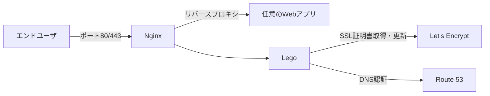

VPSなどの素のサーバでWebアプリを公開するとき、SSLをどうするかという問題がある。

弊社では、[Amazon Route 53](https://aws.amazon.com/jp/route53/)でDNS運用、[lego](https://github.com/go-acme/lego) (Go言語製のLet's Encryptクライアント)で取得した証明書を用い、[nginxのDockerコンテナ](https://hub.docker.com/_/nginx)を使った汎用的なSSLゲートウェイを立てている。

そのノウハウを共有したい。一度慣れておくとWebアプリの公開が気楽になる。

[[toc]]

---

## VPSが好きだ

Webアプリを公開する方法はたくさんある。今やちょっと古い考えではあると思うが、VPSが好みだ。

- **安くて固定費用** 月500円くらいから利用でき、急に費用が跳ね上がる心配もない。
- **開発言語を選ばない** 当然ながら自由にアレンジできる。
- **ロックインされない** 選択肢が多くサービス停止で慌てることもない。
- **サーバ構築の勉強になる** 安く抑えようと工夫すると勉強になるし、何より楽しい。

### SSLどうする問題

各種マネージドサービスなら当たり前のSSLも、VPSだと自分で用意する必要がある。

いろいろ試した末に、次のやり方に落ち着いて安定運用している。

- ドメイン管理 [Amazon Route 53](https://aws.amazon.com/jp/route53/)
  - 後述のlegoがAPIを備えたDNSを必要とするようで、Route 53が最も手軽だった
- Let's Encryptクライアント [lego](https://github.com/go-acme/lego)
  - Go言語製のシングルバイナリなので取り回しが楽
- リバースプロキシ [nginx](https://hub.docker.com/_/nginx)
  - 説明不要だがDockerを使う
- ログローテーション
  - 1日1回のログローテーションを行う

次のような構成である。



### GitHubリポジトリ

こちらにソースコード一式を公開した。

<https://github.com/ideamans/nginx-with-lego-ssl>

### 代替案

代替案としては、[https-portal](https://github.com/SteveLTN/https-portal)もお勧めしたい。

こちらの方が手軽で任意のDNSでも利用できるが、ワイルドカード証明書(例 `*.example.com`)には対応していない(今もそのはず)。

以前はこちらもよく利用していた。しかしワイルドカード証明書がやはり便利なので、本記事の方法に落ち着いたという経緯がある。

## 使い方

### Amazon Route 53を操作するIAMユーザを用意

AWSで次のポリシーを参考に、IAMユーザーを作成する。

`<INSERT_YOUR_HOSTED_ZONE_ID_HERE>`は対象ドメインのホストゾーンIDに置換すること。

```json
{
  "Version": "2012-10-17",
  "Statement": [
    {
      "Effect": "Allow",
      "Action": [
        "route53:GetChange",
        "route53:ListHostedZonesByName",
        "route53:ListResourceRecordSets"
      ],
      "Resource": [
        "*"
      ]
    },
    {
      "Effect": "Allow",
      "Action": [
        "route53:ChangeResourceRecordSets"
      ],
      "Resource": [
        "arn:aws:route53:::hostedzone/<INSERT_YOUR_HOSTED_ZONE_ID_HERE>"
      ]
    }
  ]
}
```

### .envに認証情報

`example.env`を`.env`としてコピーし、設定を記述する。必要なのは以下の4点だ。

```ini
LEGO_EMAIL=you@exmple.com # メールアドレスを記述
LEGO_DOMAIN=*.example.com # SSL証明書を取得するドメインを記述(ワイルドカード化)

AWS_REGION=ap-northeast-1
AWS_ACCESS_KEY_ID= # IAMユーザのアクセスキーID
AWS_SECRET_ACCESS_KEY= # IAMユーザのシークレットアクセスキー
```

### nginxの設定変更

`nginx/default.conf`のドメイン`nginx.ideamans.com`と`_.ideamans.com`を、利用するドメインに変更する。

ワイルドカード記号`*`を用いた場合、証明書のパス上では`_`に置換する。

例えば、ドメインは`www.example.com`、証明書は`*.example.com`で取得した場合、

```nginx
    server_name nginx.ideamans.com;
    ssl_certificate /var/lib/lego/certificates/_.ideamans.com.crt;
    ssl_certificate_key /var/lib/lego/certificates/_.ideamans.com.key;
    ↓
    server_name www.example.com;
    ssl_certificate /var/lib/lego/certificates/_.example.com.crt;
    ssl_certificate_key /var/lib/lego/certificates/_.example.com.key;
```

```nginx
    server_name nginx.ideamans.com;
    ↓
    server_name www.example.com;
```

上記のように書き換える。

### Webアプリを記述

`compose.yml`の`app`サービスを任意のWebサービスに変更する。

```yaml
  app: # ダミーアプリケーション
    image: httpd:2.4
```

### 起動

docker-composeで起動する。

```bash
docker compose up --build
# または docker-compose up --build
```

初回はLet's EncryptでSSL証明書を取得するため数分かかる。

サーバにアクセスし、このように表示されればOKである。


## 仕組み

### nginxへの補助的な機能の追加

nginxに補助的な処理を追加するために、シェルスクリプトをよく利用する。

シェルスクリプトでも関数を記述できるのだが、`&`をつけて関数を実行すると子プロセスとして並行処理できる。

```bash
#!/bin/bash

sidecar() {
  # 補助的な処理
}

sidecar &

# nginx本体を起動
exec nginx -g "daemon off;"
```

この仕組みを利用して、素のnginxにSSL証明書とログローテーションの機能を追加した。

詳しくは`nginx/entrypoint.sh`を参照されたい。

### 手軽な定期実行

定期処理といえばcronだが、Dockerコンテナでcronを使うのは何かと面倒だ。

そこでこの方法もよく用いる。`while`による無限ループと`date`、`sleep`を駆使して、毎日1回の処理をスケジューリングする小技だ。

[cronを使わず定期的にコマンドを実行する小技 #Bash - Qiita](https://qiita.com/miyanaga/items/6e0577609aaebd7b0e72)

`nginx/entrypoing.sh`でも利用している。

### 1コンテナ1ロール？

Dockerはひとつのコンテナにはひとつの役割を割り当てる原則がある。

個人的にもこれには大いに賛同するので、上記のやり方はかなり横着していると言える。

しかしケースバイケースでよいと思う。SSLゲートウェイ自体がWebアプリの脇役に過ぎない。

本記事のやり方であれば、記述するファイル数やコンテナの相互関係もシンプルになってよい。

## まとめ

公開したGitリポジトリをcloneして、あなたが作成したWebアプリを記述すればVPSで簡単に公開できる。

また、シェルスクリプトやDockerfileにて更なるカスタマイズも可能だ。

副産物のようなプロジェクトだが、汎用的であると思うのでお役に立てたら幸いである。
