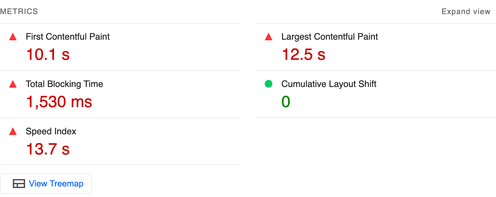
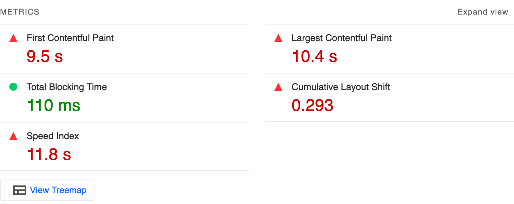

Core Web Vitals改善術の一環としてサードパーティタグの扱いについて解説する。

サードパーティタグがCore Web Vitalsに影響するというのは奇異に聞こえるかもしれないが、実は大いに関係がある。

サードパーティタグはGoogle Tag ManagerやGoogle Analyticsに代表される、外部の企業から提供されるHTMLタグであり、そのほとんどはJavaScriptを実行する。JavaScriptの動作は本来とても重いものだ。

多くの企業がサードパーティタグのメリットだけに注目し、負荷については空気のようなものと思い込んでいるが、筆者の経験上、Core Web Vitals改善の鍵はこのサードパーティタグの扱いにあると言っても過言ではない。

いわゆるWeb技術によるスピード改善と、サードパーティタグについて改善は、アプローチも責任者も違う異質な業務となる。そのためひとつの独立した記事として論じたい。

[[toc]]

---

## サードパーティタグのサイトスピードへの影響

ある通販サイトの例を見てみよう。Lighthouse(PageSpeed Insights)を実行すると、スピード指標の値は次のようになった。



続いてこのページのサードパーティタグをすべて無効にして同様に計測を行なった。



TBT(Total Blocking Time)が`1,530 ms`から`110 ms`へと著しく改善した。LCP(Largest Contentful Paint)も若干ながら改善されている。

:::info TBTとは
TBTは、メインスレッドを50ms以上占有する処理の合計(正確には50ms超過分の合計)である。

TBTの値が悪い(大きい)ページは、ユーザーがページの操作を試みてもすぐに反応しないように感じる場面が多くなる。
:::

TBTはパフォーマンススコアの計算において最も重視される指標で、30%の重みを持つ。この改善はスコアへの影響も大きい。29点から40点に評価が向上した。


### TBTとINP

Core Web Vtialsの一角に[INP(Interaction to Next Paint)](https://web.dev/articles/inp?hl=ja)がある。

TBTはINPに影響を与える指標だと言われており、TBTを改善できるとINPへの貢献も期待できる。

ただし、INPの要因はTBTだけではない。その点は後日、このシリーズのINP編で触れたい。

## サードパーティタグに対する誤解

このようにサードパーティタグはページスピードへの影響が意外と大きいのだが、見落とされることが多い。

話を聞いていると、次のような誤解があるように思う。

### 誤解: 他社のリソースなので負荷に影響はない

サードパーティタグとそれに関連するリソースは、自社のサーバーではなく他社のサーバーから配信される。だから自分たちのページの表示には負荷はかからないという発想だ。

これは誤解であり、確かに自社のサーバーやネットワークの負担はないが、ユーザーの端末においては自社だろうが他社だろうがJavaScriptは等しく実行され、CPUパワーを消費する。

JavaScriptは元来から重い機能であり、サードパーティタグとは「ユーザーの体感スピードはちょっと遅くするけど、便利だから入れてね」という代物だ。

### 誤解: 目に見えない機能だから表示に影響はない

サードパーティタグの多くはユーザーの行動を記録したり計測をしたりと、目には見えない機能を提供することが多い。目に見えない機能だから、表示スピードには影響しないという発想だ。

これも誤解であり、ページの表示に関する処理とJavaScriptの実行はほとんどがひとつのメインスレッドの上で行われる。

つまり共通のメインスレッドを奪い合う関係にあり、目に見えない機能であろうがJavaScriptが実行されると、ページ表示に関する処理はその分、割りを食って遅延するのである。

## サードパーティタグの棚卸し

サードパーティタグは自社で配信するリソースと違い、内容を改変して改善を図ることができない。どうしても消極的な手段しか取りえない。

### 使用しないサードパーティタグを削除する

もっとも効果的なのは使用しないサードパーティタグを削除することだ。

長い期間運営しているサイトだと、以前使っていたが今は使っていないサードパーティタグが少なからずあるだろう。そういったタグをコツコツと棚卸しする。

ただこの棚卸しを効果的に進めるのは難しい。担当者が不明であったり、「ないよりはあった方がいい」程度のサードパーティタグを削除する決断が重いからだ。結局、ほんの少しだけ削除して目立った効果なく終えることが多い。

個人的には一度サードパーティタグは空にして(GTMであれば新しいコンテナを用意して)、ないとサイト運営に支障が出たものタグだけを追加することをお勧めする。

### A/Bテストによる再評価

販促系のサードパーティタグはA/Bテストによる再評価をしよう。

サードパーティタグの使用によるページスピードの低下が、その機能による収益への貢献に見合うかきちんと検証し、場合によっては削除する。

サードパーティタグが空気のように軽ければ機能の追加はよい影響しかないはずだが、それは誤解であると説明した。悪影響があるかもしれない施策を検証なしに進めるのは至極妥当な話である。

## サードパーティタグの起動を遅延させる

ページをリクエストしてからの数秒はいわば「ゴールデンタイム」である。この時間にユーザーが欲しかった情報を得られないと容易に離脱される。

したがってゴールデンタイムはコンテンツの提供に全振りし、サードパーティタグの実行はその後に回すのが理想的な姿である。

コンテンツを見て離脱されるのは仕方ないが、計測が優先されてコンテンツ表示が遅れて離脱されるのではやるせない。

### タイミングを遅延させる

Google Tag Managerを利用しているなら、トリガーは`ページビュー`より`ウィンドウの読み込み`や`DOM Ready`の方がタイミングが遅い。つまりコンテンツ表示にゴールデンタイムを譲ることができる。

`script`要素を直接記述しているのであれば、例えば次のようなサードパーティタグは、

```html
<script src="https://example.com/tag.js" async></script>
```

HTMLの読み込み次第、JavaScriptの読み込みが始まる。

次のように書き換えることで`ウィンドウの読み込み`や`DOM Ready`と同等のタイミングに遅延させることができる。

```html
<script>
// ウィンドウ読み込み
window.addEventListener('load', function() {
  var script = document.createElement('script');
  script.src = 'https://example.com/tag.js';
  script.async = true;
  document.body.appendChild(script);
});

// DOM Ready相当
document.addEventListener('DOMContentLoaded', function() {
  var script = document.createElement('script');
  script.src = 'https://example.com/tag.js';
  script.async = true;
  document.body.appendChild(script);
});
</script>
```

### 計測タグはタイミングを遅延させてよいのか

サードパーティタグの遅延について挙がるのが、**「計測タグが正常に計測を行えなくなるのではないか」** という議論である。

この点については **「今も別に正常に計測などできていない。なので心配ない」** が回答となる。

商用サイトには実に多数の計測タグが埋め込まれているが、前述の通り、ひとつのメインスレッドを奪い合いながら、ただ自分の番がきたら動作する。

期待の上では、それぞれのタグが必要なタイミングで責任持って計測するようにイメージしてしまうが、実態は適当なバラバラのタイミングで計測が行われているのだ。


したがってゴールデンタイムをコンテンツ表示に譲っても計測結果に大差はない。


### スクロールにより遅延させる

サードパーティタグにはレコメンデーションなどの補助的コンテンツを展開するタイプもある。

それらの補助的コンテンツはページ下部に配置されることが多いが、ユーザーが毎回ページ下部までスクロールしてくれるかというと、その可能性の方が低い。

そのため、補助的コンテンツのサードパーティタグをページ読み込み直後のゴールデンタイムに展開するのはあまりに無駄が大きい。

そこで、ユーザーがある程度スクロールしたタイミングでサードパーティタグを起動するのがよいだろう。

ここではページの半ばほどにある要素`#half-of-page`までスクロールが進んだら、

```html
<script src="https://example.com/tag.js" async></script>
```

上記と同等の`script`要素を展開するサンプルを示す。

```html
<script>
document.addEventListener('DOMContentLoaded', function() {
  // script要素を展開しサードパーティタグを起動するコード
  var invoke = function () {
    var script = document.createElement('script');
    script.src = 'https://example.com/tag.js';
    script.async = true;
    document.body.appendChild(script);
  };

  if (window.IntersectionObserver) {
    // IntersectionObserver対応の場合は要素が50%表示された時点で起動
    var target = document.getElementById('half-of-page');
    var observer = new IntersectionObserver(function (entries, observer) {
      entries.forEach(function (entry) {
        if (!entry.isIntersecting) continue;
        invoke();
        observer.disconnect();
      });
    }, { root: null, threshold: 0.5 });
    observer.observe(target);
  } else {
    // IntersectionObserver非対応の場合は3秒後に起動
    setTimeout(invoke, 1000 * 3);
  }
});
</script>
```

### 属性に応じて遅延させる

コンテンツの翻訳サービスを提供するサードパーティタグもある。特に[WOVN.io](https://wovn.io/ja/)が有名であるが、その機能の高さゆえかJavaScriptの負荷が非常に高い。

:::info
WOVN.ioを非難する意図はまったくない点は理解いただきたいが、事実としてはサードパーティタグの中でWOVN.ioのブロッキングタイムが最長であるケースを何度も目にした。
:::

翻訳サービスは海外の非日本語話者向けの配慮であるが、日本語のサイトはおそらく95%以上は日本人がユーザーであり、日本語話者の翻訳サービスを必要としない。

弊社では例としてブラウザの言語設定を見て、それが日本語である場合に翻訳サービスの起動を遅延することを勧めている。

```html
<script src="https://j.wovn.io/1" data-wovnio="key=*****" async></script>
```

上記のようなタグの設置指示は、以下のようなJavaScriptに変更する。

```html
<script>
document.addEventListener('DOMContentLoaded', function () {
  var lang = navigator.language || navigator.userLanguage || 'en-US';
  var invoke = function() {
    var script = document.createElement('script');
    script.src = 'https://j.wovn.io/1';
    script['data-wovnio'] = 'key=*****';
    script.async = true;
    document.body.appendChild(script);
  };

  if (lang.startsWith('ja')) {
    // ブラウザの言語が日本語なら5秒遅延して起動
    setTimeout(invoke, 5 * 1000);
  } else {
    // 日本語以外なら即起動
    invoke()
  }
});
</script>
```

もちろんブラウザ設定がユーザー自身の言語とは限らない。しかしユーザー自身の言語とブラウザの言語は同一である場面が圧倒的多数であり、それ以外の比率はかなり低いだろう。

予測が外れた場合も5秒後には翻訳機能が起動するので最終的な挙動は変わらない。多数のユーザーの便益を最優先する方が望ましいという判断である。

## GTMの罠

昨今の商用サイトでGTM(Google Tag Manager)を使っていないケースは少ないだろう。そのくらい重宝されているツールであるが、実はGTM自体は重い。

Webパフォーマンスに敏感であるGoogleの提供するツールが重いというのは皮肉な話であるが、GTM自身が負荷の高いサードパーティタグの上位に必ず見られる。

### 設定の多さからくる負荷

GTMのコンテナに多数のタグ設定があると、その分ブロッキングタイムが長くなり、目立った負荷が発生する。

GTMを使用するのは致し方ないが、常に不要な設定を削除するメンテナンスが必要である。

### コンテナ数の多さからくる負荷

GTMはわりと大きなJavaScriptを読み込む。GTMのタグ管理にまつわる機能が、コンテナのJavaScriptに同梱されていると想像される。

しかし実際の運用として、ひとつのページに多数のコンテナを配置しているサイトが少なくない。サイト運用には多数の関係者がいるので、アクセス権限を分けるためにコンテナを分けていると思われる。


コンテナをたくさん読み込むと、ほとんど同じタグ管理機能のJavaScriptが重複して膨張する。それらはすべて愚直にコンパイルと評価が必要になるので、CPUに無駄に大きな負荷がかかる。

GTMは1ページ1コンテナの運用が、サイトスピードの観点からは理想である。

## サードパーティタグの改善の責任者は誰か

JavaScriptによる書き換えのテクニックも紹介したが、サードパーティタグの責任者はサイトオーナーだ。

サイトオーナーが「捨てる」「妥協する」という決断をしない限り、Web制作者には手の出しようがない。

そのため弊社ではまず、Webページからサードパーティタグを一度除外し、Web技術によるスピード改善と、サードパーティタグによるスピード改善を分けて提案している。

## まとめ

以上、サードパーティタグがサイトスピードに意外と大きな影響を及ぼしていることを説明した。

とはいえ、現代の商用Webサイトをサードパーティタグの力を借りず運営するのは困難である。その点は筆者もよく理解している。

要はユーザーの端末という限られた計算資源を、ユーザー向けの本来のコンテンツに使うのか、便利な追加機能に使うのか、サイト運営者に向けたメリットに使うのか、そのパラメータ配分の問題だ。

### Appleはサードパーティタグを使用していない

サイトスピードは重要だがサードパーティタグも必要だ、その葛藤で思考停止に陥らないよう、ひとつ実例を紹介したい。

以前このブログで触れたのだが、Appleのサイトではサードパーティタグを一切使っていないのだ。Google Analyticsすら入っていない。

- [Appleサイトはサードパーティタグを使っていない | ideaman's Notes](https://notes.ideamans.com/posts/2024/apple-has-no-3rdparty.html)

Appleとはいえ浮世離れしたサイトではなくWeb広告も活用している。筆者が推測するに、独自のトラッキングシステムを持ち、Webサーバーのアクセスログなど合わせてWeb解析を行なっているのだろう。

この事実に気づいたとき、ユーザーの端末でユーザーのメリットにならないコードは動かさない、Appleの美学はHTMLコードにも見られた気がして大変感心した。

これはAppleほどの力があれば実現できる仕組みかもしれないが、「サードパーティタグがないと絶対にサイトを運営できない」という信念があるとしたら、思い込みであると言いたかったのだ。
