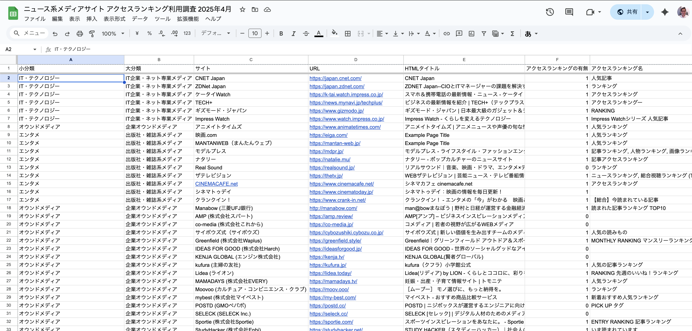

さまざまなサイトでアクセスランキングを目にするが、実際どのくらい採用されているのだろうか？ 記事コンテンツを中心としたいわゆるニュース系メディアサイト220サイトについて調査してみた。

その結果、**約 74% のサイトでアクセスランキングが表示されている** ことがわかった。

また、一般性の高いメディアにはアクセスランキングが多く、専門性が高いメディアには採用が少ない傾向も見られた。

弊社でGA4を利用したアクセスランキング表示サービス [Rankelt4](https://ranklet4.com/) を運営している一環としての調査だが、メディアサイト運営者の参考になれば幸いである。

[[toc]]

---

## 対象サイト

調査の詳細データを以下のスプレッドシートで公開した。

- [ニュース系メディアサイト アクセスランキング利用調査 2025年4月](https://docs.google.com/spreadsheets/d/1ldTw-apT69OTirMaPESrE0ehSi3_dFQUYxEaWOJvTIE/edit?usp=sharing)

サイトの選定には、AIディープリサーチを利用した。300サイトほどがピックアップされたが、

- [AIで300件ほどのメディアサイトを挙げてみた | ideaman's Notes](https://notes.ideamans.com/posts/2025/media-sites.html)

リストには転職サイトや不動産サイト、キュレーションサイト、SNSなども含まれていたため、記事コンテンツ中心のニュース・ブログサイト風のメディアサイトに絞り込んだところ、220サイトになった。

それぞれのサイトのトップページにアクセスランキング、またはそれに類似したセクションがあるかを確認した。

## ジャンル別の採用率

おおよそのジャンル別に集計し、採用率の高い順に並べたのが以下の表である。

| 大分類 | サイト数 | アクセスランキング利用 | 採用率 |
| --- | --- | --- | --- |
| 地方紙・地域紙メディア | 20 | 19 | 95.00% |
| IT企業・ネット専業メディア | 34 | 30 | 88.24% |
| 全国紙系メディア | 13 | 11 | 84.62% |
| 出版社・雑誌系メディア | 46 | 37 | 80.43% |
| 国際・通信社系メディア | 8 | 6 | 75.00% |
| TV・ラジオ局系メディア | 14 | 10 | 71.43% |
| 女性向け・ファッション誌発 | 13 | 9 | 69.23% |
| 企業オウンドメディア | 22 | 14 | 63.64% |
| 専門業界メディア | 30 | 19 | 63.33% |
| 学術・研究メディア | 11 | 4 | 36.36% |
| 行政・公共機関 | 3 | 1 | 33.33% |
| オルタナティブ・独立系 | 6 | 2 | 33.33% |
| 総計 | 220 | 162 | 73.64% |

**やはり新聞・ネットニュースメディアの採用率が高い。もはや標準機能と言っていい採用率である。**

一方、専門性の高いメディアでの採用は平均を下回る。流行や周囲の動向に関心が小さい、あるいはそうあるべきではないというポリシーが反映されているのかもしれない。

## ランキングの名称

アクセスランキングのセクションにどのような名称を用いているかが以下である。

| アクセスランキング名 | 採用サイト数 |
| --- | --- |
| アクセスランキング | 28 |
| ランキング | 20 |
| 人気記事ランキング | 15 |
| RANKING | 7 |
| 人気記事 | 6 |
| 人気ランキング | 6 |
| ニュースランキング | 4 |
| 記事ランキング | 3 |
| いま読まれています | 2 |
| その他 | 71 |
| 総計 | 162 |

「アクセスランキング」が最多で、「ランキング」「人気」がそれに次ぐ。

その他は度数1ずつの例をまとめた結果だが、それぞれ工夫が見られる。スプレッドシートにて確認できる。

## まとめ

有名サイトを中心とした220サイトの調査では、アクセスランキングは採用していないメディアサイトの方が少数という結果となった。

また、メディアの性質によっても違いがあり、呼称としては「アクセスランキング」が最も一般的であることが確かめられた。

アクセスランキングは流行を追ったり、アクセスを扇動するためだけではない。自身の興味があることと、他の人が興味のあること、そのギャップを確かめるコンテンツでもあると思う。

**GA4を利用し、最も簡単にアクセスランキングを実現するために開発した弊社サービス [Rankelt4](https://ranklet4.com/)** もよければチェックしていただきたい。
