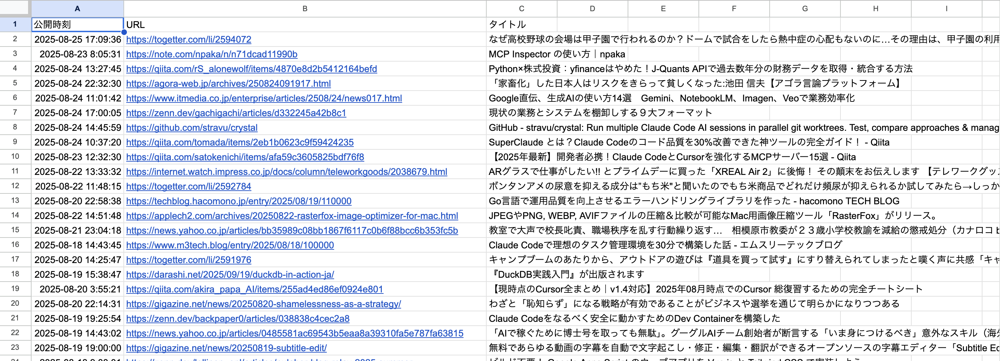

RSS リーダーの[Feedly](https://feedly.com)には長い間お世話になってきたし、有償の Pro プランを使っている。今でも UI は最高に使いやすいのだが、API が Enterprise プランしか対応しておらず使えない。

自分がブックマークした記事を AI でもっと活用したいのに、これでは不便なので[inoreader](https://www.inoreader.com/)への移行に着手した。

そうなると Feedly に溜まった「あとで読む」記事くらいは取っておきたい。というわけで、Web GUI から抜き出してみた方法を共有する。

---

## 「あとで読む」のリストをスプレッドシートに抜き出す手順

Chrome の Developer Tools には JavaScript コンソールがある。これを使うと、現在見ているページから簡易的にスクレイピングができる。

最近はそのスクリプトも AI が考案してくれるので、プログラマーでなくても覚えておいて損はない。

### Feedly の Web GUI を Chrome で開く

まずは Chrome で Feedly にログインし、Read Later を開く。


いわゆる無限スクロールで、下にスクロールすると過去の記事が追加されていく。

これで抜き出したい期間までスペースバーを連打するなどして画面に表示する。私は過去 1 年分の記事とした。

### 開発者ツールでスクリプトを実行する

次に開発者ツールを開き、`Console`に次のスクリプトを貼り付ける。

```javascript
copy(
  ['公開時刻\tURL\tタイトル']
    .concat(
      $$('div.row article').map((article) => {
        const timeSpans = article.querySelectorAll(
          'div.EntryMetadataBasic__source-info span[title]'
        )
        let publishedTime = ''

        // Published:を含むspan[title]を探す
        for (const span of timeSpans) {
          if (span.title && span.title.includes('Published:')) {
            let timeStr = span.title
              .replace(/^Published:\s*/, '')
              .replace(/\s*Received:.*$/, '')
              .trim()

            // 24時を00時に変換し、日付を1日進める
            if (timeStr && timeStr.includes(' 24:')) {
              timeStr = timeStr.replace(' 24:', ' 00:')
              const date = new Date(timeStr.replace('GMT+9', '+09:00'))
              date.setDate(date.getDate() + 1) // 1日追加

              publishedTime =
                date.getFullYear() +
                '-' +
                String(date.getMonth() + 1).padStart(2, '0') +
                '-' +
                String(date.getDate()).padStart(2, '0') +
                ' ' +
                String(date.getHours()).padStart(2, '0') +
                ':' +
                String(date.getMinutes()).padStart(2, '0') +
                ':' +
                String(date.getSeconds()).padStart(2, '0')
            } else if (timeStr) {
              const date = new Date(timeStr.replace('GMT+9', '+09:00'))
              publishedTime =
                date.getFullYear() +
                '-' +
                String(date.getMonth() + 1).padStart(2, '0') +
                '-' +
                String(date.getDate()).padStart(2, '0') +
                ' ' +
                String(date.getHours()).padStart(2, '0') +
                ':' +
                String(date.getMinutes()).padStart(2, '0') +
                ':' +
                String(date.getSeconds()).padStart(2, '0')
            }
            break
          }
        }

        const link = article.querySelector('a')
        return `${publishedTime}\t${link?.href || ''}\t${
          link?.textContent?.trim() || ''
        }`
      })
    )
    .join('\n')
)
```


これを実行すると、クリップボードにタブ区切りのテキストがコピーされる。

### Excel やスプレッドシートに貼り付ける

このテキストは表計算ツールに直接貼り付けられる。以下のように公開日時、URL、タイトルを表形式のデータにできる。



## データは誰のものか

Feedly はお気に入りのサービスで有料の Pro プランも利用してきた。しかし、データの扱いという一点においてほぼ離脱を決めてしまった。

今やどのサービスも API を広く公開している。Pro プランでも API が使えないというのはデータを人質にされて囲い込まれているストレスを感じた。

AI の活用が進む中で、自分のデータに自由にアクセスできないのはサービス提供者と利用者の間に、致命的な壁を作ることになるのではないだろうか。
