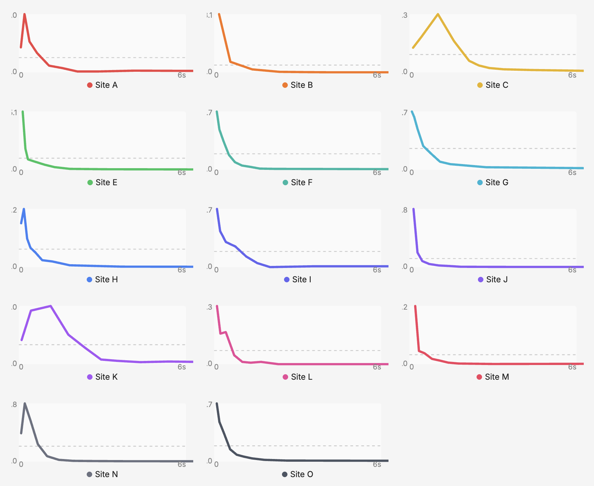

アイデアマンズ株式会社では、サイトスピードと特に通販サイトの収益性の関係を定量的なモデルにするということに対して、多大な情熱を注いでいます。スピードイズマネーというサービスがあり、スピードイズマネーというサービスはアクセス解析ツールなんですが、サイトスピードの計測とコンバージョン、あるいはPV数、訪問率、再訪問率というところで、いわゆるサイトスピードがユーザーの行動、その収益につながる行動にどう影響を与えているかを計測することに特化したアクセス解析ツールです。それに定量的なモデルを反映して提供しています。 

https://speedis.money/

この度、新しい関係モデルを考案し、それをSpeed with Moneyに反映しました。この最新の関係モデルは、かなりサイトスピードとサイトの収益性の関係を非常にクリアに説明するモデルとなり、サイトスピードを改善したときの収益性への影響というのもまた、かなり精度の高い予測を行うことができるものとなっています。それがですね、収益モデルに従ったグラフというのを見てもらうと、以下のようになります。 

このグラフは横軸にLCP、縦軸にCVR、コンバージョンレート、制約率をプロットしたものです。それがオレンジのグラフです。 これを見るとですね、CVR、LCPが悪化するとコンバージョンレートがどんどん低下していく。しかも、その低下していく様子が非常に分かりやすく表現されています。グラフを見ると、LCPの体験が良かったユーザーにおいては、全体としては良かったセッションはコンバージョンレートが2%近くまで達していますが、LCPが0.5秒、1秒ぐらいを過ぎると、ほぼ全体のCVRは0.51%です。LCPの体験が良かったユーザーによって商品の売上が支えられていて、そのLCPが悪いユーザーというのはすぐにサイトを離脱してしまって売上には貢献していないというところですね。このグラフは、とある通販サイト、実際の通販サイトで過去90日間のサイトスピードとそこでのコンバージョンレート、制約率の関係を見たものです。 

次ですね、このLCPといっても、どのようにセッションのLCPを代表しているかというところなんですけども、かつてスピードイズマネーでLCPとCVRなどのパフォーマンスを解析するときに使っていた指標が、単純にセッションにおける平均LCPの値だったと。そのセッションというのはユーザーが複数のPVを体験するという一連の流れですね。注文が完了するか、あるいは離脱してしまうまでの一連のPVの連なりの中で、それぞれのLCPから平均値を求めたものと、それとLCPの平均値とCVRの関係をプロットするというのが従来の計算モデルだったんですね。 

ただですね、この平均値をLCPの代表値に使ってしまうというのはすごく大きな問題がありました。というのはですね、LCPというのは同じユーザーの体験であっても、当然そのページごととかタイミングによってばらつきが生じるんですね。当然1回だけのPVですごく良いLCPが出るということがある一方で、PV数が増えていくとLCPの平均値というのはだんだんやっぱり1回で偶然良い値が出るよりは平均LCPというのはそれよりは悪くなるという傾向というか、このような平均値の特性としてどうしても発生します。通販サイトというのは当然PV数がある程度多い方がコンバージョンに寄与するという関係性がある以上、実は因果関係の逆転がここで生じてしまうんですね。PV数が、本来LCPが良いユーザーほどコンバージョンレートが高くなるという仮説が、おそらく仮説が成り立つわけなんですけども、コンバージョンするにはある程度のPV数が必要ですと。そうするとPV数が増えると今度はLCPの平均値はどんどん悪化してしまう。ご視聴ありがとうございました。LCPが仮に早いユーザーでも、1回で直記してしまったユーザーの方が、LCPの平均値としては良い数値が出てしまうという、因果関係の逆転がどうしても挟まってしまう。そうすると、平均LCPが良すぎてもコンバージョンレートが低くなるという。 

そこで今回考案した方法が、LCPの代表値を平均値ではなくて、そのセッションにおける最初のLCPの値にすると。要は一番早かったLCPの値にするということを、新しい関係モデルでは採用してみたというところです。それを採用したところ、LCPとCVRの関係をクリアに説明できるものとなりました。この最小値をセッションのLCPの代表値にするというのがどういう意味を持っているかというと、なんとなく直感に反するところがあって、LCPの平均値というのがユーザーのサイトにおける体験を非常に代表しているもので、その一番小さな値を取ってくるというのがなんとなくフェアではないイメージがするかもしれませんが、実はこれちょっと合理的な意味があってですね。LCPの最小値が低いセッション、悪いセッションですね。LCPの最小値が、例えばですけど、5秒といったようなユーザーのセッションがあったとしたら、そのセッションというのは、要はLCPが5秒より早い体験が一度もできなかったというセッションになるんですね。もしかしたらそれで1回で離脱してしまったかもしれないけども、複数ページを見たユーザーであっても、要は1回もその5秒以内でLCP5秒以内でサイトを体験できなかったということで、これはですね、すごくサイト体験としては悪いものという説明がつくんですね。逆に最小LCPの値が小さな体験というのは、これも当然それによってユーザーの体験全体が優れたものであるという保証にはならないんですけども、少なくとも良い体験ができたPVが一つでもあったというのが、最小LCPが良いというセッションの特徴になります。なので、最小値、要はPVをサイトに訪問していくつかのページビューを見てみたけれども、結局いい体験が一度もできなかったというのが、最小LCPの値が悪いセッションの性質になるわけです。やっぱりそのように一度もいい体験ができないハズレを引いてしまったユーザーというのは、当然その離脱をすごくしやすくなります。逆に、当然最小値が小さいからといって全体の体験がいいわけではないんだけども、最小値が非常に小さなセッションのグループというのは、というのはすごくオーガニックな体験をしていると。サイトのスピードはPVによってばらつきはあるんだけども、少なくとも全ての体験が悪かったわけではないというのが、最小LCPが小さなセッションの性質になっています。 なので整理するとですね、要はろくな体験ができなかったユーザーほどサイトを離脱しやすくなって、コンバージョンレートが低くなるということを、関係性として示したのがこのグラフになっているというところです。 

ただですね、LCPの最小値と平均値で、要は全く性質の違う指標化というと、そうでもなくてですね、実は最小値と平均値には結構強い相関関係が見られます。以下のグラフがセッションごとの最小LCPと平均LCP - 横軸に最小LCP、縦軸に平均値というのを要は相関性を見るためにヒートマップでプロットしたものなんですけども、非常に強い相関性が出ていることがわかります。相関係数としては0.9188ということで、これは非常に強い相関係数、強い相関が見られるということです。なので、直感的には平均LCPがコンバージョンレートに強く影響しそうなものではあるんですけども、それの代わりに最小LCPを使ってもある程度、平均LCPを使うという因果関係を受け継いで、両者の関係を説明できるという要素があります。 

このようなLCPとCVRの関係は、要はこのサイトだけたまたまこのような綺麗な関係性が見られたのではないかという可能性もあります。そのため、以下の画像を見てほしいのですが、これはSpeed with MoneyでのLCPとサイトスピード、そしてコンバージョンCVRの収益性に関する関係性調査に協力をいただいた14の通販サイトにおけるものです。LCPと同様に、LCPを横軸、CVRを縦軸にプロットしたときに、両者の関係がどうなるかというグラフをこの14サイトについて見てもらうものです。このグラフを見てもらうと、ほとんどすべてのサイトで同じような傾向が見られることがわかります。LCPが悪化するほど、CVRは非常に急激に下がっていきます。 

ただ、一部のサイトにおいて、グラフの一番左のパフォーマンスが逆に低いというのがいくつか見て取れると思います。例えば、サイトCとかサイトK、サイトA、サイトCなどですね。これが、すごく直感に反するところで、先ほどのLCPを平均値として、LCPの平均値をセッションの代表値にしたときの逆転現象に近いものがどうしても起きてしまっています。

実は、このLCPが良すぎるセッションのCVRがむしろ下がってしまっているように見えるこの理由は、明らかになっていて、例えばそのトップページとか特殊ページって比較的そのキャッシュが効いて、ページの表示が早いんですね。ただ、広告とか検索エンジンから飛んでくると、トップページとか特集ページみたいな比較的表示の早いページにランディングして、それで直帰してしまうユーザーが、数としては多くなってきます。

そのユーザーは直帰率が高いにもかかわらず、LCPが比較的良かったというところで、そういったユーザー体験をしたセッションが左側に偏ってしまうと、サイトスピードが速すぎても収益性が低いという、ちょっと歪みが見えてしまいます。実際に、このLCPが良すぎると、コンバージョンレートが低い、少し低くなるっていうサイトの特徴を見ると、サイトのアクセスの傾向を具体的にちょっと比較をすると、直帰ユーザーであるということになります。 

一方で、LCPと同じCore Web Vitalsの一つにINPという指標があります。LCPとINPについては説明が欲しいですね。それは後で書いてもらうとして。INPについてもですね、実は最小INPの値を横軸、縦軸にCVR、コンバージョンレートをですね、プロットしたグラフがですね、その以下なんですけども、INPについては完全に先ほどの逆転現象というのは見られず、とにかくINPが良ければ一部デコボコはあるものの、INPが良ければコンバージョンレートも良い。逆に最初はINPが悪の、つまりINPにおいてもろくな体験ができなかったユーザーというのは離脱して、コンバージョンにその売上に対して全く貢献しないという傾向が見られるというのが以下のグラフで見て取れるかなと思います。 

先ほど見てもらったLCPとCVRの関係を一旦定量的なモデルとして仮定して、LCPをもし改善できたとしたら、このCVRがどれくらい良くなるかというのを予測するために応用してみたいと思います。先ほど見てもらったLCPとCVRのグラフなんですけれども、どのようにプロットしたかというと、セッションを10%ずつ分割して、要は階級にするんですね。それぞれの階級の代表値をLCPとして横軸にプロットし、その階級におけるCVRを縦軸にプロットしたというのがこの前のグラフでした。そのグラフにセッション数も書き加えてみると、次のようなグラフになります。 

posts/2025/speedismoney-modeling-v4/min-lcp-cvr-sessions.png

セッション数がほぼ横一列で同じ値をとっています。これはセッションを十分に割ったので、当然セッションの数としてはそれらの階級でセッションの数がほぼ同数になっているという意味を表しています。もし例えば、全体のLCPを例えば10%、5%、10%改善できたと仮定すると、この階級の区間の値を保ったこのグラフは、最小LCPの区間によって予想されるCVRの関係性を示しているものです。それを一旦モデル化すると、要はそのCVRをこのサイトにおけるLCPとCVRの関係性を法則化したいわゆる定量モデルの一つであるとみなして、この階級に対してもしLCPを5%改善すると、このセッション数の割合がどのように再配分されるかをシミュレーション、再配分をしてみます。区間を固定して、LCPの値がもし5%改善されたら、それぞれの区間の度数、セッション数というのがどのぐらい変化するかを計算するわけです。そうするとですね、サイトのスピードを改善すると、このLCP、CVRの良い階級に対して少しずつ全体的にセッションが寄っていくような動きをするわけですね。今までLCPが少し低かったところから、CVRがちょっと低い階級からCVRがちょっと高い階級に移るというようなセッションの再配分が発生します。その再配分をした後のCVRを改めて過重平均で計算すると、サイトスピードの改善によって離脱が減るとどれくらいCVRの改善が期待できるかという計算を行うことができるはずです。 

posts/2025/speedismoney-modeling-v4/lcp-cvr-prediction.png

このグラフがシミュレーションの結果なんですね。緑のヒストグラムが10%もしLCPが改善されたときの階級に対するセッションの再配分を示したものになっていて、LCPが良くてCVRも良いという領域のセッション数というのが少し増加しました。これを計算し直すことによって、CVRが全体としてどのくらいになるかというのを予想するというふうに使ってみたわけです。この結果ですね。10%LCP改善できると、CVRは全体として8.58%改善すると、つまりそれだけ商品が売れやすくなり、離脱が減って商品が売れやすくなるわけですので、売上としても単純に言って8.58%の売上の増加が見込めるということですね。 

先ほどLCPあるいはINPとCVRの関係性を見てもらった14サイトについて、同じ予測モデルを使ってそれぞれのサイトのLCP改善に対する収益性のCVRの改善率をシミュレーションしてみたのが、以下のグラフです。 

posts/2025/speedismoney-modeling-v4/sites-lcp-cvr-simulations.png

これを見るとですね、かなりスピード改善に対してCVRの改善率というのはすごく直線的に線形の予測ができるということが見て取れます。サイトによってはですね、非常にスピード改善することによって収益性が上がることが大きく収益性改善できるという結果も出ています。サイトによってはその15%スピード改善すると40%以上のですね、売上改善が期待できると一方で15%改善しても、大体10%弱ぐらいしか収益、CVRとしては改善が見込めないというサイトもあります。このようにですね、仮に10%、15%というふうにLCPを改善したとしても、どれくらいサイトの収益性に影響があるかというのは結構サイトによってばらつきがありますということがこのグラフを見てわかります。 

というわけでですね、中央値を見てみるとですね、15%改善時のCVRの改善の中央値はですね、プラス13.181%ということで、傾きとしてはですね、だいたい0.88ぐらいなんですね。なので、一つのLCPなりス
  ピード改善をすると、どれくらい本当に収益が上がることを期待できるのかという、一つの目安としては、大体その10%改善するごとに、大体8%から9%ぐらいの収益の改善が期待できるということですね。た
  だ、このシミュレーションにおいて注意してほしいのは、かなり理論的なLCPの改善というふうになっていて、要はその一律10%なり15%の改善ができたという過程に立っています。なのでですね、例えば5秒
  の人が4.5秒になったりとか、1秒の人が0.9秒になったりということで、一定の比率によってLCPの改善を、全ての体験において一律の比率でLCPを改善できたという過程になっているので、なかなかですね、
  そういうどのLCPの時間帯においても同じ比率で改善するっていうのは、ですね、ちょっと理論的に寄りすぎているところではあるんですけども、それでもですね、やっぱりこれまでのサイト改善の予測、サ
  イトのスピード改善をした時にどれぐらいその収益が上がるかっていうのって、結構やってみないとわからないバックチの領域だったわけです。でもこのようにですね、LCPとLCPなり、サイトスピードの指
  標とコンバージョンレートというのをしっかりと計測してモデル化することによって、バックチではない、ある程度定量的な根拠のある収益の、ですね、収益向上の見込みを事前に計算することができると
  いうことです。

今回のセッションごとの最小LCPに対するCVRの関係を見て、両者の関係性を定量的にモデリングするという手法と、それに基づく予測にも使ってみるという説明を今までしてきました。この予測モデルの弱点を挙げるとしたら、おそらくサイトスピードの改善をすることによってLCPが一番良いCVR、そのCVR自体も良い体験においてもう少し上昇するはずだということです。例えばこのサイトであれば、最小LCPが小さなオーガニックな体験ができたセッショングループのCVRは2%くらいだったわけですけど、この2%という数値もですね、もうちょっと大きく上振れするという可能性があります。その可能性についてはですね、考慮ができていないというのは、最小LCPに基づく関係性の説明、それからそれを用いた予測の弱点ではあるんですけども、逆に言うとこの予測に対するCVRの上昇予想から上振れしかしない、要は若干過小評価をしているようなものです。少なくともこのぐらいの収益性の改善は期待できるであろうというのを最低ラインをですね、予想の最低ラインを説明するようなこのモデルになっているので、不正確ではあるんですけども、課題評価してブレが出るというものではないというのは、弱点と言いつつ、まだマシな部分というか、安心できる部分かなと思います。 

というわけでですね、このようなシミュレーション、コンバージョンレート、LCPなどのサイトスピードのコアウェブバイタルズなどのスピード指標とコンバージョンレートの関係性、それからですね、それを用いた収益の予測っていうのを簡単にできるアクセス解析、無料のアクセス解析ツールとして、そのSpeed is Moneyを提供しているのでぜひちょっと興味を持った方は使ってみていただきたいなと思います。 

https://speedis.money/