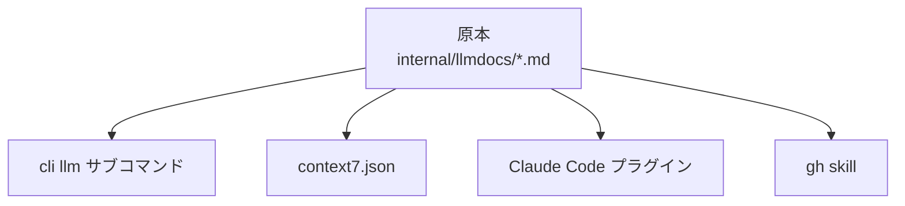

弊社ではAIエージェントに外部サービスとの連携をさせるとき、Go言語でAPIをラップしたCLIをサクッと作り、それをエージェントに使わせるというパターンを取っている。

CLIを用意するところまではよいのだが、エージェントはそのCLIの使い方を知らない。

AIエージェントへ情報を提供する手段はいくつかある。

- コマンドにLLM向けのヘルプを実装する
- Claude Codeのプラグインにする
- `gh skill` に対応する

これらの他にも多くのやり方が試行錯誤されている。しかし提供したい情報そのものは共通だ。出力先によってフォーマットと見せ方が変わるだけである。

このワンソースマルチユースを引き受けるツールキットを作った。それが go-llm-cli-kit である。MITライセンスのオープンソースとして公開している。

- [ideamans/go-llm-cli-kit](https://github.com/ideamans/go-llm-cli-kit)

[[toc]]

---

## 1つのナレッジを4つの形式で配る

リポジトリ内のMarkdownを1か所にまとめ、そこから4つの形式へ派生させている。



形式ごとに届くエージェントと前提が違う。

| 形式 | 届くエージェント | 前提 |
|---|---|---|
| `<cli> llm` | ローカルでCLIを実行できる全エージェント | バイナリのみ |
| context7 | context7 MCPを繋いだエージェント | publicリポジトリのみ |
| Claude Codeプラグイン | Claude Code | マーケットプレイス登録 |
| `gh skill` | Copilot / Cursor / Gemini CLI / Codex など | `gh` v2.90.0以降 |

このモジュールが提供するGoのパッケージは4つで、依存は cobra だけである。

- `llmdocs` — embedしたMarkdownの章を名前順に結合し、MarkdownまたはJSONで返す
- `catalog` — cobraのコマンドツリーからコマンドカタログを生成する
- `llmcmd` — 標準の `llm` サブコマンドを足す
- `skillcheck` — 配布用のSKILL.mdとplugin.jsonを検証する

## CLIリポジトリのファイル構成

具体例をみてみよう。CrUXのデータを引く自社CLI `crux-cli` から、この仕組みに関わる部分だけを抜き出す。

```
crux-cli/
├── cmd/crux/
│   ├── main.go              # llm サブコマンドを生やす
│   ├── gen_llmdocs.go       # コマンドカタログの生成器
│   └── plugin_test.go       # skillcheck を回すテスト
├── internal/llmdocs/
│   ├── llmdocs.go           # go:embed と go:generate
│   ├── 00-guide.md          # 手書き。鉄則・認証・ワークフロー
│   ├── 10-metrics.md        # 手書き。指標の説明
│   ├── 20-schemas.md        # 手書き。出力スキーマ
│   ├── 30-gotchas.md        # 手書き。落とし穴
│   └── 90-commands.md       # 生成物。コマンドカタログ
├── plugins/crux-cli/
│   ├── .claude-plugin/plugin.json
│   └── skills/
│       ├── crux-usage/SKILL.md
│       └── crux-install/SKILL.md
└── context7.json            # publicリポジトリのみ
```

知識の原本は `internal/llmdocs/` のMarkdownだけだ。他は全部ここから派生する。章の順番はファイル名の数値プレフィックスで決まる。

| 範囲 | 用途 | 書き方 |
|---|---|---|
| `00-guide.md` | 鉄則・認証・代表ワークフロー・失敗モード | 手書き |
| `10-` 〜 `89-` | トピック章 | 手書き |
| `90-commands.md` | コマンドカタログ | 生成 |

## 原本に何を書くか

`00-guide.md` は人間向けのREADMEとは別物で、エージェントが読んですぐ動けることを狙う。crux-cli の実物から抜粋する。

```markdown
# crux — reference for AI agents

`crux` queries Chrome UX Report (CrUX) real-user performance data
from the command line.

This reference is embedded in the binary — `crux llm` always describes
the exact version you are running.

## Two independent data sources

**BigQuery** → `crux device`
- Monthly, origin-level aggregates.
- Requires a Google Cloud project; BigQuery query cost is billed to it.

**CrUX API** → `crux history`, `crux record`
- Free public REST API. Needs only an API key.
- Works on an origin or a specific URL (page).

## Rules for agents

1. **Always pass `-f json`** when you are going to parse the result.
   The default `table` format is for humans.
2. All density / fraction fields are proportions in `[0,1]`.
3. **A density or p75 of `0` usually means missing or insufficient data.**
```

先頭には鉄則を置き、「エージェントが一番間違えること」から書き始めている。crux-cli であれば、2つのデータソースを取り違えることと、`0` を「速い」と読んでしまうことがそれにあたる。

章の後半には失敗モードの表を置く。症状とその原因、エージェントが取るべき対処を並べておく。

## `<cli> llm` で全部出す

CLI側の組み込みは2か所で済む。まず章をバイナリに埋める。

```go
// internal/llmdocs/llmdocs.go
package llmdocs

import (
	"embed"

	kit "github.com/ideamans/go-llm-cli-kit/llmdocs"
)

//go:generate go run ../gen-llmdocs

//go:embed *.md
var files embed.FS

func Docs() *kit.Docs { return kit.New(files, ".") }
```

次にサブコマンドを生やす。

```go
// main.go
cfg := llmcmd.Config{Docs: llmdocs.Docs()}
llmcmd.AddTo(root, cfg)
```

これで次の3つが使えるようになる。

```bash
crux llm                  # Markdown
crux llm --format json    # 章ごとのJSON配列
crux --llm                # 非推奨。後方互換で残してある
```

この形なら、実行中のバイナリとバージョンが必ず一致する。ドキュメントサイトのように古くなることもないし、ネットワークも要らない。

なお `--llm` フラグは、このツールキットを作る前のCLIが持っていた形である。`crux device --llm` のようにコマンドラインのどの位置でも動く挙動を維持しないと、既存の利用が止まってしまう。そのための処理が `llmcmd.HandleLegacy` だ。

## 生成するのはコマンドカタログだけ

当初はSKILL.mdやcontext7のルールも生成する計画だった。しかし実装してみると、手書きの方がよいものになった。

どちらも読み物であり、落とし穴を選ぶ判断は人間の仕事だからだ。機械的に導けるのはコマンドとフラグの一覧しかない。

そこで生成器はコマンドカタログの1本に絞った。cobraのコマンドツリーをそのままMarkdownにする。

```go
md := catalog.Markdown(cmd.Root(), catalog.Options{
	Title: "Command catalog",
	Skip:  []string{"llm"},
})
os.WriteFile("90-commands.md", []byte(md), 0o644)
```

## 生成物と原本がズレない仕組み

Goでは `go:embed` がビルド時に実ファイルを要求する。よって `90-commands.md` はgitで追跡せざるを得ない。

追跡すると、コマンド定義だけ直してカタログの再生成を忘れたコミットが起こりうる。そこでCIで再生成して差分の有無を見る。

```yaml
- run: go generate ./...
- run: git diff --exit-code
- run: go test ./...
```

なお同じ目的でも、TypeScript製のgridgramやchartjs2imgでは生成物を追跡しない方針にしている。ビルド時に毎回生成するので、ズレた状態のコミットが構造的に起きないからだ。判断は正反対だが、狙いはどちらも同じである。

避けたいのは「追跡するがCIで検査しない」形だ。ズレた生成物がそのままmainに乗ってしまう。

## SKILL.mdは標準フィールドだけで書く

配布するスキルは、frontmatterと本文からなる1枚のMarkdownである。crux-cli の実物をみてみよう。

```markdown
---
name: crux-usage
description: Look up real-user web performance data with the crux CLI —
  Core Web Vitals (LCP, INP, CLS) and related metrics from the Chrome UX
  Report. Use when the user asks how fast a site is for real users, about
  Core Web Vitals or field data, or wants to compare performance between
  sites or over time.
license: MIT
compatibility: Requires the `crux` binary on PATH — run the crux-install
  skill if it is missing. The history and record subcommands need a CrUX
  API key (free).
allowed-tools: Bash(crux:*) Bash(jq:*) Bash(command:*) Read Write
---

## 1. Confirm the tool is available

    command -v crux || echo "missing"

## 2. Load the reference

    crux llm
```

frontmatterに使えるのはAgent Skillsの標準フィールドだけにしている。

| フィールド | 必須 | 書くこと |
|---|---|---|
| `name` | Yes | 1〜64文字のkebab-case。親ディレクトリ名と一致させる |
| `description` | Yes | 「何をする」と「いつ使う」の両方。エージェントはここを見て起動を判断する |
| `license` | No | ライセンス |
| `compatibility` | No | 環境要件。バイナリの所在や必要な資格情報 |
| `allowed-tools` | No | 実験的だが各社が尊重する |
| `metadata` | No | Claude固有の挙動は `metadata.claude-code.*` へ逃がす |

逆に `argument-hint` や `paths` や `model` はClaude Codeの拡張であり、他のエージェントでは単に無視される。標準フィールドに絞れば、Claude・Copilot・Cursor・Gemini CLI・Codexのどれでも同じものが読める。

見落とすと他のエージェントで意図どおりに動かないため、`skillcheck` が検出して `go test` を失敗させる。

```go
func TestPluginSkills(t *testing.T) {
	report := skillcheck.CheckDir("plugins/crux-cli", skillcheck.Options{
		Version:             version,
		Keywords:            []string{"crux", "web-vitals"},
		RequireInstallSkill: true,
	})
	for _, p := range report.Problems {
		t.Error(p)
	}
}
```

ローカル用の `.claude/skills/` は逆にClaude拡張を自由に使ってよい。検証の対象外である。

本文は手順であって、マニュアルではない。マニュアルは `crux llm` が持っている。スキルの本文はまずバイナリの有無を確かめ、次に `crux llm` を読ませる、という段取りを書くだけでよい。

## installスキルを必ず添える

配布するスキルは最低2本にしている。CLIを使って仕事をする `<cli>-usage` と、導入と更新を担う `<cli>-install` だ。

`-install` を足したのは、インストール方法を人間が学んで実行するのが面倒だったからである。スキルを入れたのにバイナリがPATHにいない、という状態で止まってしまう。そのたびにREADMEを開いて、リリースページを見て、自分で置き場所を決めることになる。

本当は、Claudeにスキルを入れ、CLIが無ければ「ついでに入れておいて」と頼めば済む状態にしたかった。そこで `skillcheck` の `RequireInstallSkill` で、配布するスキルには必ず1本含めるようにした。

導入の経路は3本を優先順に固定してある。

1. PATHにある既存バイナリを使う（最新版の確認はしない）
2. GitHub Releasesから取得する（publicは `curl`、privateは `gh release download`）
3. ソースからビルドする（Goツールチェインが要るので最下位）

`sudo` の実行とシェルプロファイルの編集は、エージェントの判断でやらせずユーザーに委ねる。

## LLMナレッジが古いことには誰も気づかない

ここまでの仕組みは「原本を更新すれば派生物が追随する」ことを保証する。しかし原本自体の更新漏れは誰も検出できない。

フラグを1つ足したときに `00-guide.md` の鉄則を書き足すかどうかは、最後まで人間とエージェントの判断に残る。

ドキュメントとヘルプが古ければ人間が読んで気づく。ところがLLMナレッジが古いことには誰も気づかない。エージェントが黙って間違えるだけで、症状は「なぜかうまく使えない」という形でしか現れない。

そこで各CLIのCLAUDE.mdに、変更時の必須手順を表で書いている。直す先は①ドキュメント ②ヘルプ ③LLMナレッジの3点セットだ。

## まとめ

- AIエージェントへの情報提供は形式が複数あるが、配りたい知識そのものは1つである
- 原本はリポジトリ内のMarkdown1か所に置き、`<cli> llm`・context7・Claudeプラグイン・`gh skill` へ派生させる
- 生成するのはコマンドカタログだけでよい。読み物は手書きの方がよいものになる
- 配布するSKILL.mdはAgent Skillsの標準フィールドに絞る
- LLMナレッジの陳腐化は誰も検出できないため、更新手順をCLAUDE.mdに明記する

社内のGo製CLI15本がこのモジュールを取り込んでいる。

- [ideamans/go-llm-cli-kit](https://github.com/ideamans/go-llm-cli-kit)
