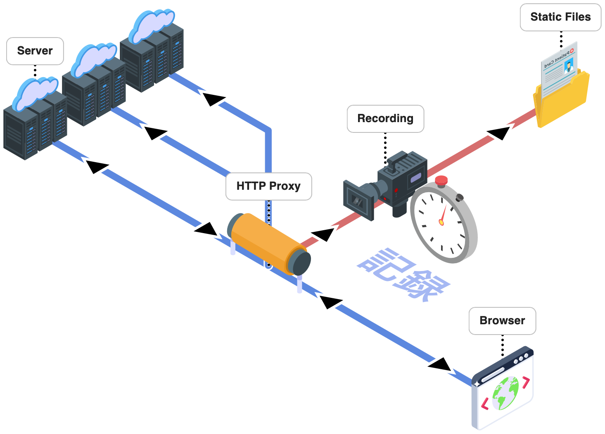
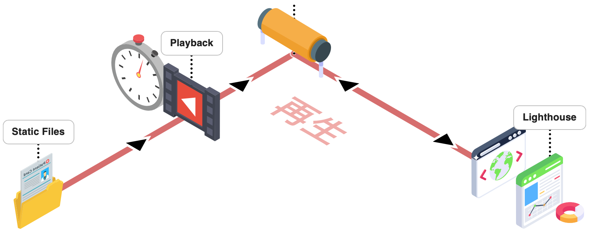
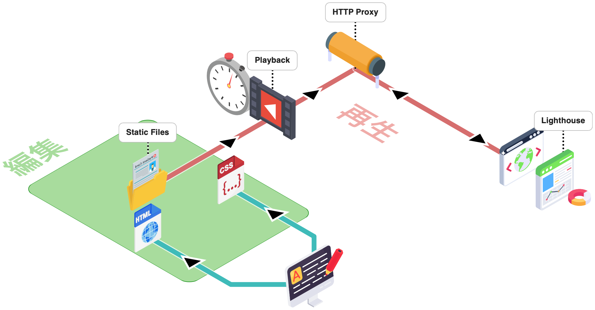
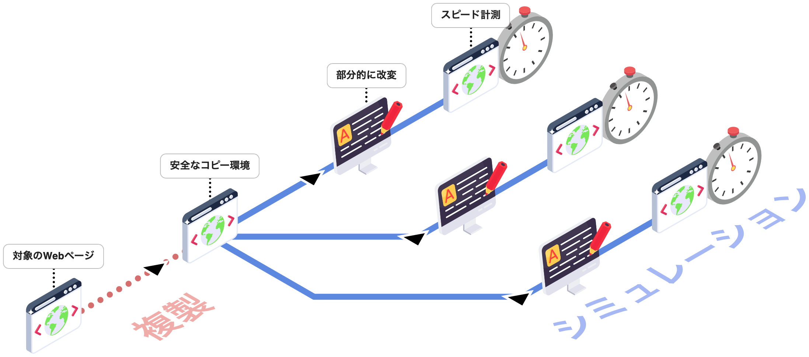

Webページの表示スピード改善は、やはり実際に変更して計測をしてみないと効果がわからないことがほとんどである。そのため、できれば本番環境には手を加えず、どこを変えたらどうなるかを何度も繰り返しシミュレーションしたい。そのための技術として「http-playback-proxy」をオープンソースで公開している。

[ideamans/rust-http-playback-proxy - GitHub](https://github.com/ideamans/rust-http-playback-proxy)

このツールは、**Webページ表示に必要なすべての通信を記録し、それを再生することでWebページの精巧なコピー環境を作り上げる** ものである。以前はTypeScriptで開発していたが、現在はRustで書き直し、より高速かつ動作が正確になるよう改善している。

[[toc]]

---

## http-playback-proxyとは

### HTTPプロキシについて

そもそもHTTPプロキシとは、**ブラウザとサーバーの間に立つ中継サーバー** のことである。ブラウザやOSには標準機能としてHTTPプロキシを指定する仕組みが備わっており、設定すればすべての通信を指定したサーバー経由で行うようになる。

企業ネットワークでのアクセス制御やキャッシュ、開発時のデバッグなど、さまざまな用途で利用されている。

### http-playback-proxyの特徴

http-playback-proxyは、このHTTPプロキシの一種である。特徴は **「記録」と「再生」** の2つのモードを持つこと。

**記録モード**では、ブラウザがWebページを表示する際の一連のリソース取得を監視する。どんなリソースが、どのタイミングで、どれくらいの遅延で届いたか。すべての通信をファイルとして記録する。

**再生モード**では、この記録に基づいてサーバーからデータが返ってきているかのような「幻覚」をブラウザに見せる。ブラウザはサーバーにアクセスしているつもりでも、実際には事前に記録されたデータが返されている。

エンジニアの方であればVCR系のライブラリをご存知かもしれない。VCRはAPIのような単独の通信を記録・再生するものだが、http-playback-proxyはそれを **ブラウザのWebページ表示全体に拡張** したようなソフトウェアである。

Webページの表示に関する一連の通信プロセスをほぼ完全に再現できるため、**本物のサーバーなしに** Webページの表示を再現できるのである。

以下、この仕組みについて図解を交えて詳しく解説する。

## 記録と再生の仕組み

### 記録（Recording）

記録モードでは、ブラウザはhttp-playback-proxyをプロキシとして設定し、通常どおりWebページを閲覧する。

プロキシはブラウザとサーバーの間に立ち、すべての通信を監視する。このとき記録されるのは単なるレスポンスデータだけではない。

- **レスポンスボディ** - HTML、CSS、JavaScript、画像などのコンテンツ
- **HTTPヘッダー** - Content-Type、Cache-Controlなどのメタ情報
- **タイミング情報** - リクエストから最初のバイトが届くまでの遅延（TTFB）、データ転送完了までの時間

現代のWebページが単一のサーバーからデータを配信されることは稀である。サードパーティのタグ、CDN、広告ネットワークなど、複数のサーバーからリソースを取得して1つのページを構成している。

http-playback-proxyはこれらすべてのサーバーとの通信を記録する。結果としてWebページ表示に必要なあらゆるリソースが漏れなくキャプチャされる。

:::info TTFBとは
TTFB（Time To First Byte）は、リクエストを送信してから最初の1バイトが返ってくるまでの時間である。サーバーの応答速度やネットワーク遅延を反映する重要な指標となる。
:::

### 再生（Playback）

再生モードでは、ブラウザは引き続きhttp-playback-proxyをプロキシとして使用する。しかし今度はプロキシがサーバーに問い合わせることはない。

ブラウザからリクエストが来ると、プロキシは記録されたデータの中から該当するレスポンスを探し出す。そして記録されたタイミング情報に従って応答を返す。

たとえばあるリソースの取得に元々200msかかっていたなら、再生時も200ms待ってからレスポンスを返す。これによりWebページの表示プロセスがスピード面でも忠実に再現される。

ブラウザから見ると **実際のサーバーにアクセスしているのとまったく区別がつかない**。Lighthouseのようなスピード計測ツールも通常どおりページを計測できる。

## 編集しやすいデータ形式

http-playback-proxyの大きな特徴は、記録されたデータが非常に編集しやすい形式であることだ。

通常、HTTPレスポンスは圧縮されていたり、ミニファイされていたりする。しかしhttp-playback-proxyは記録時にこれらを展開・整形する。

- **圧縮の展開** - gzip、brotliなどの圧縮を解いて保存
- **文字コードの統一** - Shift-JISなど旧来の文字コードもUTF-8に変換
- **コードの整形** - ミニファイされたHTML、CSS、JavaScriptを読みやすく整形

結果として記録されたファイル群は、まるで **手作りの静的サイトのような構造** になる。ファイルを開けば普通にHTMLやCSSとして読み書きできる。

:::info なぜ編集しやすさが重要か
スピード改善の検証では、CSSの一部を削除したり、JavaScriptの読み込み順を変更したりする作業が頻繁に発生する。そのたびに圧縮やミニファイを解除する手間がかかっては効率が悪い。最初から編集しやすい形式で保存することで、試行錯誤のサイクルを高速に回せるようになる。
:::

## 編集と再生による検証

記録されたデータは自由に編集できる。そして編集した内容は次回の再生に反映される。

たとえば以下のような検証が可能である。

- **CSSの最適化** - 不要なスタイルを削除してファイルサイズを減らす
- **JavaScriptの遅延読み込み** - スクリプトにdefer/async属性を追加する
- **画像の軽量化** - 画像を圧縮して差し替える
- **リソースの結合・分割** - 複数のファイルを1つにまとめる、または分割する

編集後、再生モードでLighthouseなどの計測ツールを実行すれば、変更がスピードにどう影響するかを即座に確認できる。

## 3つのメリット

この仕組みがもたらすメリットは大きく3つある。

### 1. スピーディな試行錯誤

これまで解説したように、http-playback-proxyを使えばスピード改善のアイデアと検証をスピーディに繰り返すことができる。記録されたデータを編集し、再生して計測する。このサイクルを何度でも回せる。

従来であれば開発環境の構築、コードの修正、デプロイ、計測という長いプロセスが必要だった。http-playback-proxyならファイルを編集してすぐに計測できる。

### 2. 本番環境に影響を与えない

以前は、スピード改善の効果を検証するには実際にサイトを修正して本番に反映する必要があった。うまくいかなかったら戻す。その繰り返しである。

http-playback-proxyを使えば、**本番サイトには一切手を加えずに検証できる**。記録されたコピー環境の中でいくら実験しても本番には影響しない。安全に何度でもやり直しがきく。

### 3. 環境の再現が不要

スピード改善のために開発環境を用意しようとすると意外と大変である。シンプルな静的サイトならまだしも、データベースと連携した動的サイト、複雑なインフラ構成のサイトでは環境の再現自体が技術的に困難な課題になる。

さらに社外のコンサルタントや専門家に協力を仰ぐ場合、環境や情報の共有がボトルネックになりがちである。

http-playback-proxyは、**Webページのフロントエンド構成だけを高い精度で複製する**。バックエンドのデータベースやアプリケーションサーバーは不要である。必要なのは記録されたファイル群だけ。これならチーム外との共有も容易だ。

## 活用例：PageSpeed改善リハーサル

この仕組みを活用して提供しているのが「**PageSpeed改善リハーサル**」というサービスである。

[PageSpeed改善リハーサル](https://rehearsal.sitespeed.info/)

対象のWebページを複製して安全なコピー環境を作り、そこであらゆるスピード改善施策のシミュレーションを実施する。

1. 対象ページの複製（安全なコピー環境を作成）
2. 改善施策の適用（画像軽量化、CSS最適化、JS遅延読み込みなど）
3. 効果測定（Lighthouseでスコアを計測）
4. 繰り返し検証（複数のアイデアを比較）

事前にどの施策がどれくらい効果的かを把握した上で、本番への適用を進められる。**「やってみないとわからない」から「効果を確認してから実装する」へ**。スピード改善のアプローチが変わるのである。

## まとめ

http-playback-proxyは、Webページの表示プロセスを丸ごと記録・再生することで精巧なコピー環境を作り上げるツールである。

- **記録** - ブラウザがページを表示する際のすべての通信をキャプチャ
- **再生** - 記録に基づいてブラウザにタイミングまで再現した「夢」を見せる
- **編集** - 記録されたデータは静的サイトのように自由に編集可能
- **検証** - 編集結果がスピードに与える影響を即座に確認

MITライセンスのオープンソースとして公開している。GoやTypeScriptからも利用可能である。

[ideamans/rust-http-playback-proxy - GitHub](https://github.com/ideamans/rust-http-playback-proxy)

スピード改善に取り組む方は、ぜひ活用いただきたい。
